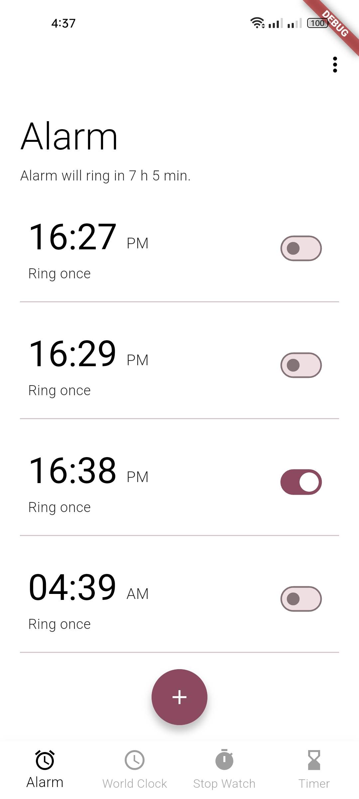
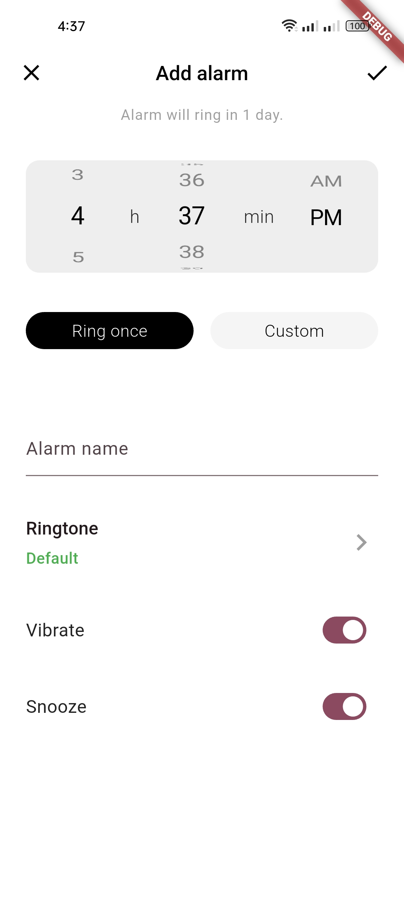
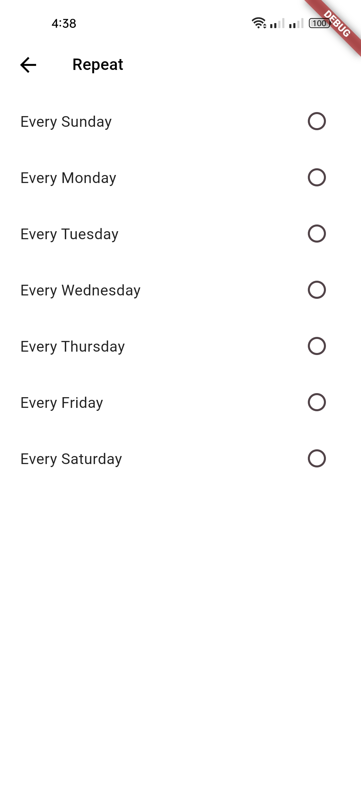

# Alarm App

A simple Flutter alarm app with a modern UI for creating, toggling, and managing alarms.

## Features

- Create custom alarms with hour/minute picker
- Toggle alarms on or off
- Set repeat days for recurring alarms
- Add custom alarm labels
- Snooze control
- Vibration toggle
- Multi-select deletion for managing multiple alarms
- Local SQLite storage for saved alarms

## Screenshots

### Alarm list



### Add alarm screen



### Custom repeat selection



## Tech Stack

- Flutter
- Dart
- Provider for state management
- SQLite for local alarm storage
- flutter_local_notifications for scheduled notifications

## Project Setup

1. Clone the repository
2. Open the project in Flutter
3. Run:

```bash
flutter pub get
flutter run
```

## Notes

This project is designed for Android and includes local alarm scheduling functionality with notification-based reminders.
